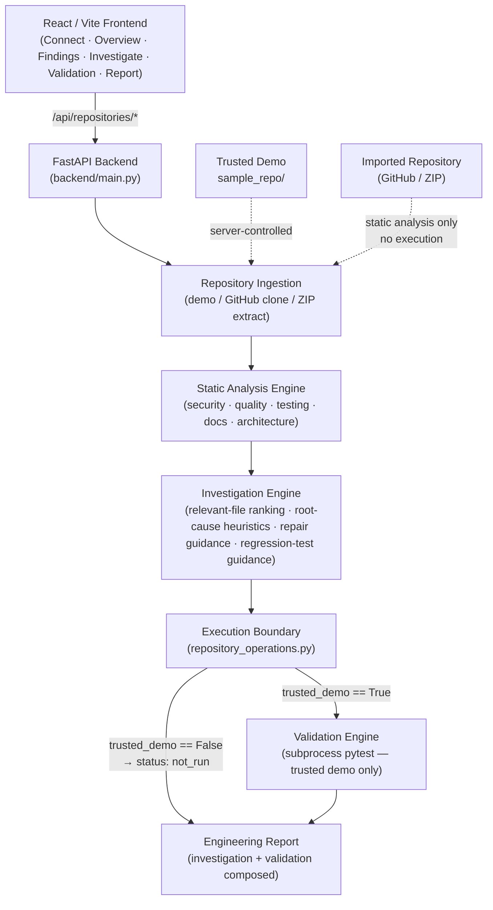

# RepoMedic

> **AI Repository Diagnostic & Debugging Agent** — IBM Bob 2.0 Hackathon submission

RepoMedic guides developers from an unfamiliar or broken repository to a structured engineering report: health analysis, prioritized findings, heuristic root-cause investigation, repair guidance, regression-test guidance, and validation — in one continuous workflow.

---

## What is RepoMedic?

RepoMedic is a full-stack developer tool that combines two tightly coupled workflows:

1. **Repository Health Diagnosis** — static analysis of code quality, security posture, testing coverage, documentation, and architecture, producing a prioritized findings list and a health score.
2. **Bug Investigation & Engineering Report** — given a finding or a free-text issue description, RepoMedic identifies relevant files, produces a heuristic likely-root-cause analysis, offers repair guidance and regression-test guidance, runs a controlled validation step (for trusted repositories), and composes the results into a downloadable engineering report.

The system was **built with IBM Bob 2.0** as a core AI-assisted engineering tool throughout the entire development lifecycle.

---

## The Problem

Understanding an unfamiliar repository is slow and error-prone:

- Which files matter for this bug?
- What is the likely root cause?
- What should be repaired and in what order?
- What regression test should protect the fix?
- Did the existing test suite still pass?

Most developers do this manually, context-switching across editors, grep, documentation, and CI logs. RepoMedic compresses that cycle into a single guided workflow.

---

## The Solution

RepoMedic's workflow:

```
Repository
  → ingestion (built-in demo / public GitHub URL / ZIP upload)
  → repository health analysis (health score + findings)
  → finding selection or free-text issue entry
  → relevant-file identification
  → heuristic root-cause analysis
  → repair guidance
  → regression-test guidance
  → validation (controlled execution for trusted demo; static-only for imports)
  → engineering report
```

All analysis is static heuristics. No imported repository code is ever executed.

---

## Demo — Golden Path for Judges

The fastest way to see the full workflow is the **built-in demo**, which uses a controlled synthetic repository bundled with the project.

1. Start the backend and frontend (see [Quick Start](#quick-start)).
2. Open `http://localhost:5173` in your browser.
3. On the **Connect** screen, click **Load Demo Repository**.
4. RepoMedic automatically analyzes the demo repository and navigates to **Overview**.
5. Review the health score (**73 / 100**) and the finding summary.
6. Navigate to **Findings** to see all 5 findings (1 high, 3 medium, 1 low).
7. Click any finding to pre-populate the investigation issue in the **Investigate** tab.
8. On the **Investigate** tab, click **Investigate** to run heuristic root-cause analysis.
9. Navigate to **Validation** and click **Run Validation** — the demo's controlled test suite executes (12 run / 12 passed).
10. Navigate to **Report** and click **Generate Report** to produce a full engineering report.

> The built-in demo is the only mode in which validation executes code. Imported GitHub and ZIP repositories are static-analysis only — their code is never executed.

---

## Core Capabilities

| Capability | Description |
|---|---|
| Repository health scoring | Severity-weighted score (0–100) derived from static findings |
| Multi-language static analysis | Python, JavaScript, HTML, CSS and more |
| Prioritized findings | Severity-ranked list: high / medium / low |
| Finding categories | Security, quality, testing, documentation, architecture |
| Relevant-file identification | Heuristic ranking of files most likely related to a reported issue |
| Root-cause analysis | Heuristic likely-root-cause based on keywords, rules, and file content |
| Repair guidance | Suggested fix text for the identified likely root cause |
| Regression-test guidance | Recommendation text for a regression test — not automatic test generation |
| Controlled validation | pytest execution against the trusted built-in demo only |
| Engineering report | Consolidated report: investigation + validation outcome in one view |
| Execution protection | Imported repository code is never executed — static analysis only |

---

## Repository Input Modes

| Mode | Source | Code Execution | Trust Level |
|---|---|---|---|
| **Built-in Demo** | Bundled `sample_repo/` | ✅ Controlled pytest suite runs | Trusted — server-controlled synthetic repository |
| **Public GitHub URL** | `https://github.com/owner/repo` | ❌ Never executed | Untrusted — static analysis only |
| **ZIP Upload** | Client-uploaded archive | ❌ Never executed | Untrusted — static analysis only |

**Security boundary:** For GitHub imports and ZIP uploads, validation always returns `status: not_run` with `reason: untrusted_repository`. No imported code reaches a subprocess or interpreter. This is enforced in [`backend/services/repository_operations.py`](backend/services/repository_operations.py) at the execution-policy boundary, not as a UI-level opt-out.

---

## Architecture



**Key design decisions:**
- The React frontend proxies all `/api` calls to the FastAPI backend; no API key is required to run locally.
- Repository paths are **never** supplied by the HTTP client — all paths are server-resolved.
- The execution boundary is enforced in `repository_operations.validate()`: untrusted workspaces return a blocked `ValidationResult` without touching subprocess.

---

## IBM Bob 2.0 Engineering Workflow

RepoMedic was **built with IBM Bob 2.0** as a core AI-assisted software-engineering tool. IBM Bob was used throughout the engineering lifecycle, not as a runtime dependency of the application.

> **Important distinction:** IBM Bob is not called at runtime by RepoMedic. RepoMedic's analysis, investigation, and report engines are deterministic Python services. IBM Bob was the team's AI-assisted development environment — the tool used to plan, design, implement, review, and verify the system.

### Evidence by team member

All session screenshots are stored under [`bob_sessions/`](bob_sessions/).

**Member 1 — Core Backend, Investigation Engine, Integration**
Eleven session screenshots covering:

| Session | Task |
|---|---|
| `team_member1_01_repository_plan.png` | Repository planning and project architecture |
| `team_member1_02_backend_foundation.png` | Backend foundation (FastAPI app, lifespan, routers) |
| `team_member1_03_api_schemas.png` | API schema and contract development |
| `team_member1_04_investigation_engine.png` | Investigation engine development |
| `team_member1_05_investigate_api.png` | `/api/investigate` endpoint development |
| `team_member1_06_validation_engine.png` | Validation engine development |
| `team_member1_07_regression_test_workflow.png` | Regression-test recommendation workflow |
| `team_member1_08_engineering_report.png` | Engineering report pipeline |
| `team_member1_09_backend_workflow.png` | Backend workflow orchestration |
| `team_member1_10_backend_integration.png` | Backend integration |
| `team_member1_14_final_security_review.png` | Final security and hackathon-readiness review |

**Member 2 — Repository Analysis Engine**
Two session screenshots covering:

| Session | Task |
|---|---|
| `team_member2_task01_merge_analysis_summary.png` | Repository analysis merge and summary |
| `team_member2_task01_test_results.png` | Analysis engine test results |

**Member 3 — Frontend / UX**
Ten session screenshots covering phases 1–7 of the frontend workflow, plus engineering summary and validation result evidence:

| Session | Task |
|---|---|
| `Bob Hackaton phase 1 screen.png` / `Bob hackaton screen Phase1 .png` | Frontend phase 1 |
| `Bob hackaton screen phase 2 .png` / `Bob hackaton screen final phase 1-2.png` | Frontend phase 2 |
| `Bob hackaton screen phase 3.png` / `Bob hackaton screen final phase 2-3-4.png` | Frontend phases 3–4 |
| `Bob Hackoton screen phase 4.png` | Frontend phase 4 |
| `Bob hackaton screen final phase 5-6-7.png` | Frontend phases 5–7 |
| `engineering_summary.png` | Engineering summary |
| `validation_real_result.png` | Validation real result |

---

## Security by Design

| Mechanism | Details |
|---|---|
| **Controlled workspaces** | All imported repositories are materialized in private temporary storage owned by the server process |
| **No client-supplied paths** | HTTP requests never specify filesystem paths, Git URLs, or test commands; all are resolved server-side |
| **Execution boundary** | `repository_operations.validate()` checks `workspace.trusted_demo` before invoking subprocess |
| **Imported code never executes** | GitHub and ZIP validation returns `status: not_run, reason: untrusted_repository` unconditionally |
| **No shell=True** | `subprocess.run` is always called with `shell=False` and a fixed argument list |
| **Body size limits** | `RepositoryBodyLimit` middleware caps upload size and concurrent uploads before parsing |
| **Subprocess timeout** | pytest is bounded to 60 seconds; `TimeoutExpired` returns `status: error` |
| **Credential hygiene** | `.gitignore` and `.bobignore` prevent credential files and Bob session data from being committed; see [`SECURITY.MD`](SECURITY.MD) |

The synthetic `sample_repo/` contains a deliberately fake credential marker (`FAKE_DEMO_KEY_NOT_REAL`) that triggers the security heuristic. It is not a usable credential and is never logged or returned in finding responses.

---

## Verified Results

### Project-wide test suite

```
470 passed, 1 skipped
```

Run with:
```bash
python -m pytest -q
```

### Built-in demo analysis

| Metric | Value |
|---|---|
| Files analyzed | 16 |
| Languages detected | Python, JavaScript, HTML, CSS |
| Health score | 73 / 100 |
| Findings — high | 1 |
| Findings — medium | 3 |
| Findings — low | 1 |
| Total findings | 5 |

### Built-in demo validation (trusted demo only)

| Metric | Value |
|---|---|
| Tests run | 12 |
| Passed | 12 |
| Failed | 0 |
| Status | passed |

---

## Tech Stack

| Layer | Technology |
|---|---|
| Backend | Python · FastAPI · Uvicorn |
| Frontend | React 18 · Vite 5 |
| Testing | pytest · httpx |
| Data validation | Pydantic v2 |
| Development environment | IBM Bob 2.0 · Git · GitHub |

Dependencies: [`requirements.txt`](requirements.txt) (backend) · [`frontend/package.json`](frontend/package.json) (frontend).

---

## Quick Start

### Prerequisites

- Python 3.9+ (POSIX — macOS or Linux)
- Node.js 18+ and npm
- Git (required only for GitHub import; not needed to start the app)

### Backend

```bash
python3 -m venv .venv
source .venv/bin/activate
pip install -r requirements.txt
python -m uvicorn backend.main:app --host 127.0.0.1 --port 8000
```

### Frontend

In a second terminal:

```bash
cd frontend
npm install
npm run dev
```

Open `http://localhost:5173`. The frontend proxies all `/api` calls to the backend at `127.0.0.1:8000`.

### Health check

```bash
curl http://127.0.0.1:8000/health
# {"status":"ok"}
```

---

## Testing

```bash
# Full project test suite (from project root, with .venv active)
python -m pytest -q

# Specific test files
python -m pytest tests/test_investigation.py -v
python -m pytest tests/test_validation.py -v
python -m pytest tests/test_repository_api.py -v
```

Expected result: **470 passed, 1 skipped**.

---

## API Overview

The primary repository-scoped workflow uses `/api/repositories`:

| Endpoint | Method | Description |
|---|---|---|
| `/api/repositories/demo` | POST | Load built-in demo repository |
| `/api/repositories/github` | POST | Import a public GitHub repository |
| `/api/repositories/zip` | POST | Upload and import a ZIP archive |
| `/api/repositories/{id}` | GET | Describe a loaded repository |
| `/api/repositories/{id}` | DELETE | Release repository handle and storage |
| `/api/repositories/{id}/analyze` | POST | Run static analysis |
| `/api/repositories/{id}/investigate` | POST | Run heuristic investigation on an issue |
| `/api/repositories/{id}/validate` | POST | Run validation (trusted demo only) |
| `/api/repositories/{id}/workflow` | POST | Full pipeline: investigate → validate → report |
| `/health` | GET | Backend liveness check |

Legacy single-repository endpoints (`/api/analyze`, `/api/investigate`, `/api/validate`) remain supported and are backed by the same services.

Full API contract: [`documentation/REPOSITORY_INGESTION.md`](documentation/REPOSITORY_INGESTION.md).

---

## Project Structure

```
RepoMedic/
├── backend/
│   ├── main.py                  # FastAPI application entry point
│   ├── api/                     # HTTP endpoint routers
│   │   ├── analyze.py           # POST /api/analyze
│   │   ├── investigate.py       # POST /api/investigate
│   │   ├── validate.py          # POST /api/validate
│   │   └── repositories.py      # POST/GET/DELETE /api/repositories/*
│   ├── analyzers/               # Static analysis engine (Member 2)
│   │   ├── engine.py            # Analysis orchestrator
│   │   ├── security.py          # Heuristic credential detection
│   │   ├── quality.py           # Code quality analysis
│   │   ├── testing.py           # Test coverage analysis
│   │   ├── documentation.py     # Documentation analysis
│   │   └── health.py            # Health score calculation
│   ├── models/
│   │   ├── schemas.py           # Shared Pydantic schemas
│   │   └── repositories.py      # Repository-scoped models
│   └── services/
│       ├── investigation.py     # Investigation engine (Member 1)
│       ├── validation.py        # Validation engine (Member 1)
│       ├── workflow.py          # Workflow orchestration (Member 1)
│       ├── report.py            # Engineering report composition (Member 1)
│       ├── repository_import.py # GitHub/ZIP ingestion
│       ├── workspaces.py        # Workspace registry and execution boundary
│       └── repository_operations.py  # Execution-policy boundary
├── frontend/
│   ├── src/
│   │   ├── App.jsx              # Application root and state
│   │   ├── components/          # Connect · Layout · Overview · Findings
│   │   │                        # Investigation · Validation · Report · UI
│   │   └── services/api.js      # API client
│   └── vite.config.js           # Dev proxy → backend:8000
├── tests/                       # 470-test project suite
├── sample_repo/                 # Controlled synthetic demo repository
├── bob_sessions/                # IBM Bob session screenshots (evidence)
│   ├── member1(Member 1)/          # 11 sessions
│   ├── member2/                 # 2 sessions
│   └── member3/                 # 9 sessions
└── documentation/               # Execution plan, ingestion contract, demo notes
```

---

## Team Contributions

| Member | Role | Key Deliverables |
|---|---|---|
| **Member 1** | Core Backend · AI-Assisted Debugging Engine · Technical Lead · Integration | Investigation engine · Root-cause analysis workflow · Relevant-file identification · Repair recommendation · Regression-test workflow · Validation engine · `/api/investigate` and `/api/validate` · Engineering report pipeline · Backend integration · Final system integration and technical verification |
| **Member 2** | Repository Analysis Engine | Static analysis engine · Findings system · Repository health scoring · Analyzer testing and integration |
| **Member 3** | Frontend / UX | React/Vite frontend · All six application views (Connect, Overview, Findings, Investigation, Validation, Report) · API client · User-facing repository workflow |

---

## Prototype Scope and Limitations

RepoMedic is a hackathon prototype. The following limitations are intentional and honestly represented:

- **Heuristic diagnosis only.** Root-cause analysis is keyword-rule-based and probabilistic. Confidence scores reflect heuristic match quality, not proof of correctness.
- **No automatic code repair.** RepoMedic provides repair *guidance* text. It does not patch files, open pull requests, or apply any change to a repository.
- **No automatic executable test generation.** RepoMedic provides regression-test *recommendation* text. It does not create, write, or run new test files.
- **Imported repositories are never executed.** GitHub and ZIP imports are static-analysis only. Validation for imported repositories returns `not_run` unconditionally.
- **Language depth varies.** The static analysis engine produces useful findings across Python, JavaScript, HTML, and CSS. Deeper semantic analysis for all supported languages is outside the prototype scope.
- **Single-worker, POSIX only.** The backend is designed for one Uvicorn worker on macOS or Linux. Multi-worker or Windows deployments are outside the current scope.
- **No authentication.** Repository IDs are unguessable capability tokens, but the system has no user authentication layer.

---

## Bob Evidence

IBM Bob session screenshots are stored in [`bob_sessions/`](bob_sessions/) organized by team member:

- [`bob_sessions/member1(Member 1)/`](bob_sessions/member1(Member 1)/) — 11 screenshots (planning through final security review)
- [`bob_sessions/team_member2/`](bob_sessions/team_member2/) — 2 screenshots (analysis engine integration)
- [`bob_sessions/team_member3/`](bob_sessions/team_member3/) — 10 screenshots (frontend phases 1–7, validation result, engineering summary)

Judges are invited to browse these directories directly in the repository.

---

## Additional Documentation

| Document | Contents |
|---|---|
| [`documentation/HACKATHON_EXECUTION_PLAN.md`](documentation/HACKATHON_EXECUTION_PLAN.md) | Full team engineering and execution plan |
| [`documentation/REPOSITORY_INGESTION.md`](documentation/REPOSITORY_INGESTION.md) | Complete repository-scoped API contract |
| [`documentation/SAMPLE_REPO_DEMO.md`](documentation/SAMPLE_REPO_DEMO.md) | Controlled demo repository design and known findings |
| [`SECURITY.MD`](SECURITY.MD) | Credential management and security guidelines |
| [`MEMBER2_INTEGRATION.md`](MEMBER2_INTEGRATION.md) | Member 2 branch integration notes |

---

## Hackathon

**Event:** IBM Bob 2.0 Hackathon — hosted on LabLab.ai  
**Project:** RepoMedic — AI Repository Diagnostic & Debugging Agent  
**Built with:** IBM Bob 2.0 IDE (AI-assisted software engineering workflow)  
**Team size:** 3 developers  

RepoMedic demonstrates how IBM Bob 2.0 can be used as a core engineering tool — driving planning, design, implementation, testing, security review, and integration across a full-stack AI developer-workflow application, delivered within a hackathon build window.
